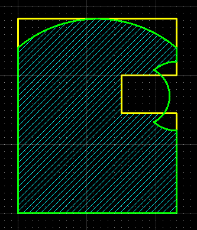

# netcore-sci

[](https://www.nuget.org/packages/netcore-sci/)

.NET core sci

- [API Documentation](https://devel0.github.io/netcore-sci/html/namespace_search_a_thing.html)
- [Changelog](https://github.com/devel0/netcore-sci/commits/master)

**note** : from v2.0.0 some tk parts were removed ( look at [v1.30](https://github.com/devel0/netcore-sci/tree/980868dd4c6b64bcccd108df90d99bb77a0cf076) for these )

<hr/>

<!-- TOC -->
* [Build](#build)
* [Examples](#examples)
    - [0001](#0001)
    - [0002](#0002)
    - [0003](#0003)
* [Quickstart](#quickstart)
    - [create an example](#create-an-example)
* [Unit tests](#unit-tests)
* [How this project was built](#how-this-project-was-built)
* [IOT](#iot)
<!-- TOCEND -->

<hr/>

## Build

```sh
mkdir ~/opensource
git clone https://github.com/devel0/netcore-util.git
git clone https://github.com/devel0/netcore-sci.git

cd netcore-sci
#git submodule update --init --recursive
dotnet build
```

:point_right: To make dependency netcore-util debuggable comment `PackageReference` and uncomment `ProjectReference` for corresponding netcore-util reference from [csproj](netcore-sci/netcore-sci.csproj)


## Examples

#### 0001

create a dxf

[result dxf](https://raw.githubusercontent.com/devel0/netcore-sci/master/examples/0001/output.dxf)


#### 0002

detect polygons ( line, arcs ) intersection loops

[result dxf](https://raw.githubusercontent.com/devel0/netcore-sci/master/examples/0002/output.dxf)


#### 0003

detect polygons ( line, arcs ) intersection loops when edges overlaps

[result dxf](https://raw.githubusercontent.com/devel0/netcore-sci/master/examples/0003/output.dxf)



## Quickstart

- [nuget package](https://www.nuget.org/packages/netcore-sci/)

- [api](https://devel0.github.io/netcore-sci/html/namespace_search_a_thing.html)

- [extension methods](https://devel0.github.io/netcore-sci/html/class_search_a_thing_1_1_sci_ext.html)

```csharp
using SearchAThing;
```

- [toolkit methods](https://devel0.github.io/netcore-sci/html/class_search_a_thing_1_1_sci_toolkit.html)

```csharp
using static SearchAThing.SciToolkit;
```

## Basic concepts

### Side effects

If not explicitly described in function documentation with a declaration of `(side effects)` all netcore-sci classes operates without side effects on the object.

For example:
```csharp
Vector3D a(1, 2, 3);
var b = a.SetX(10);
```

The vector a created with X:1, Y:2, Z:3 will subjected to a SetX(10) but the vector a itself not changed; instead it returns a new instance with X:10, Y:2, Z:3.

### Tolerances

- any function in this library that involves some test of comparision between numbers requires as first argument a tolerance parameter
- the tolerance depends on the domain application you are working on, for example if you work on mm lengths then a 1e-1 could enogh
- when working with normalized vector3d regardless of the domain application the constant `NormalizedLengthTolerance` should used ( if has a 1e-4 default value that is enough to work with double and floats )
- note that the tolerance doesn't influence for example in how accurate is the result of an intersection because the value if computed with maximum resolution doubles provides; tolerance are used only when tests ( EqualsTol, ... ) used in internal algorithm to make decisions.

### Vector3D

- used to represent 3d coordinate ( X, Y, Z ) but used also to keep dummy 2d coordinate ( X, Y, 0 )
- length of a vector3d is the distance of the point from origin

### Line3D

- defined by a From vector3d ( line application point ) and an extension from there through vector V
- To is defined as From + V
- line3d can be created giving (From, To) or (From, V) if specify the overriden method with Line3DConstructMode.PointAndVector
- extension methods allow to create line from a vector p and using
  - p.LineTo(Vector3D to)
  - p.LineV(Vector3D v) : To = p+v
  - p.LineDir(Vector3D dir, double len) : To = p+dir*len
- line3d represent an infine line, semiline or segment depending on the usage, for example intersect method allow to specify the behavior ( default: infinite lines )

### Arc3D

- circle3d inherit from arc3d
- arc is defined in the range [AngleFrom, AngleTo] rotating right-hand over its coordinate system zaxis
- arc angles are normalized in the range [0, 2pi)

### CoordinateSystem3D

- defined by vector3d origin, basex, basey, basez
- origin is used in vectro3d ToUCS(), ToWCS() methods to translate between different ucs origins ( WCS origin is 0,0,0 )
- basex,y,z are 3 vector3d vectors linearly independant
- cs can be built in various manners, for example by giving an origin and a single vector3D (the normal) then by using an arbitrary axis algorithm it detects appropriate x-y axes. ( used in dxf for example because allow to save 1 vector3d; other methods allow to build cs by giving an origin and two vectors v1, v2 by specifying a SmartCsMode to instruct the wizard on how to consider these in relationship ( normally the smart mode X_YQ consider that v1 is the wanted X axis while v2 is in the xy plane and must not be parallel to the first v1; to obtain a numerical stable cs the angle v1,v2 should near to PI/2 but this depend on the application you are working on, in some cases 5-10deg could enough to compute the normal, then yaxis will be back computed from the z cross x ).

## Unit tests

- debugging unit tests
  - from vscode just run debug test from code lens balloon
- executing all tests
  - from solution root folder `dotnet test`
- testing coverage
  - from vscode run task ( ctrl+shift+p ) `Tasks: Run Task` then `test with coverage` or use provided script `./generate-coverage.sh`
  - extensions required to watch coverage ( `Coverage Gutters` )


## How this project was built

```sh
mkdir netcore-sci
cd netcore-sci

dotnet new sln
dotnet new classlib -n netcore-sci

cd netcore-sci
dotnet add package netcore-util
dotnet add package netcore-psql-util
dotnet add package netDXF.Standard
dotnet add package ParagonClipper
# follow requires nuget.config with "searchathing-forks" source key enabled
dotnet add package QuantumConcepts.Formats.STL.netcore
cd ..

dotnet new xunit -n test
cd test
dotnet tool install --global dotnet-sonarscanner
dotnet add reference ../netcore-sci/netcore-sci.csproj
dotnet add package Microsoft.NET.Test.Sdk --version 16.7.0-preview-20200519-01
dotnet add package coverlet.collector --version 1.3.0
dotnet add package coverlet.msbuild --version 2.9.0
cd ..

dotnet sln netcore-sci.sln add netcore-sci/netcore-sci.csproj
dotnet sln netcore-sci.sln add test/test.csproj
dotnet restore
dotnet build
dotnet test test/test.csproj
```

## IOT

[iot-sci](https://github.com/devel0/iot-sci) is a c++ port of this library.
