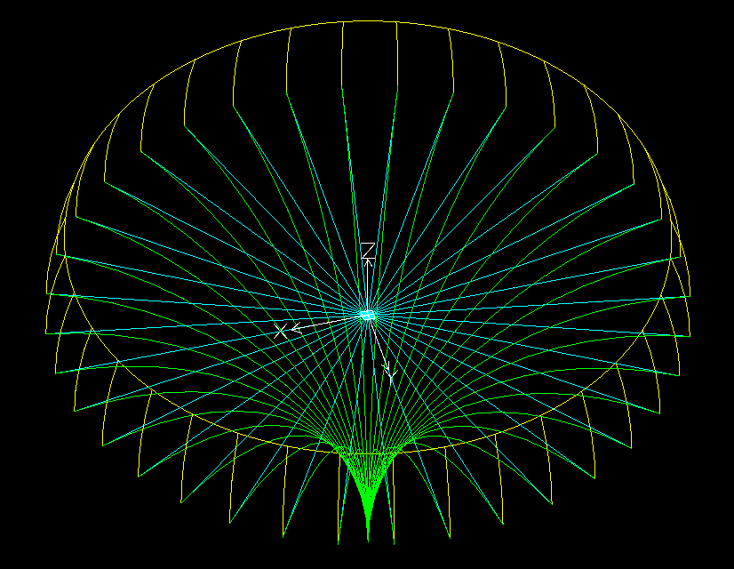
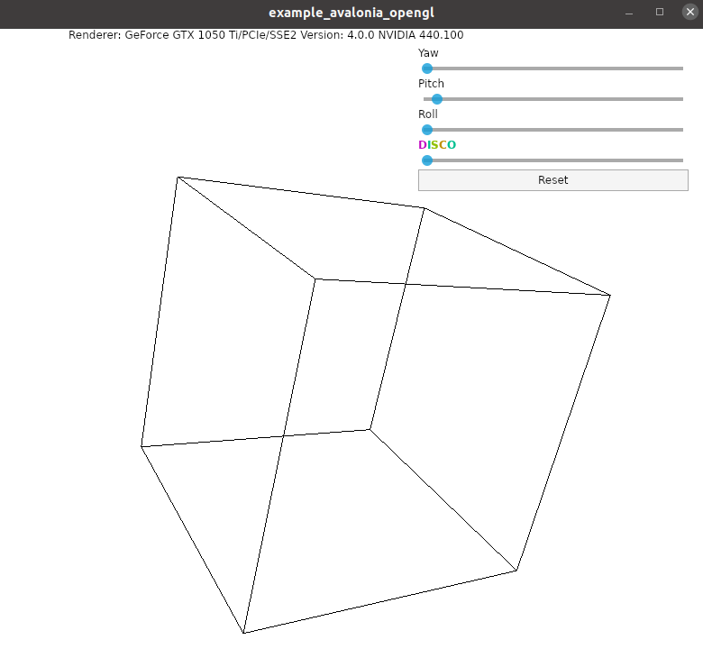

# netcore-sci

[](https://www.nuget.org/packages/netcore-sci/)

[](https://sonarcloud.io/dashboard?id=devel0_netcore-sci)

.NET core sci

- [API Documentation](#api-documentation)
- [Quickstart](#quickstart)
- [Unit tests](#unit-tests)
- [How this project was built](#how-this-project-was-built)

<hr/>

## API Documentation

- **3D Geometry**
  - [Vector3D](doc/api/Sci/Vector3D.md)
  - [Line3D](doc/api/Sci/Line3D.md)  
  - [Quaternion](doc/api/Sci/Quaternion.md)
  - [Transform3D](doc/api/Sci/Transform3D.md)  
  - [CoordinateSystem3D](doc/api/Sci/CoordinateSystem3D.md)
  - [Plane3D](doc/api/Sci/Plane3D.md)
  - [Arc3D](doc/api/Sci/Arc3D.md)
  - [Circle3D](doc/api/Sci/Circle3D.md)
  - [Geometry](doc/api/Sci/Geometry.md)
  - [BBox3D](doc/api/Sci/BBox3D.md)  
  - [DiscreteSpace](doc/api/Sci/DiscreteSpace-1.md)
  - [DxfKit](doc/api/Sci/DxfKit.md)
  - [Polygon](doc/api/Sci/Polygon.md)
- [**Extension methods**](doc/api/SciExt.md)
- [Python wrapper](doc/api/PythonPipe.md)
- **Measure unit and physical quantities**
  - [Measure](doc/api/Sci/Measure.md)
  - [PhysicalQuantity](doc/api/Sci/PhysicalQuantity.md)
  - [PQCollection](doc/api/Sci/PQCollection.md)
  - [MeasureUnit](doc/api/Sci/MeasureUnit.md)
  - [MUDomain](doc/api/Sci/MUDomain.md)
  - [MUCollection](doc/api/Sci/MUCollection.md)

## Quickstart

From [examples](examples) follow [example_0001](examples/example_0001) can be created following these steps:

- create console project

```sh
dotnet new console -n example_0001
cd example_0001
```

- **from 1.1.34** ensure [nuget.config](nuget.config) in your project in order to locate avalonia 0.9.999 packages because currently there isn't nuget packages for avalonia with OpenGlControlBase used in the project ( see [issue](https://github.com/AvaloniaUI/Avalonia/issues/4148) )

- add reference to netcore-sci ( check latest version [here](https://www.nuget.org/packages/netcore-sci/) )

```sh
dotnet add package netcore-sci
```

if prefer to link source code directly to stepin with debugger add project reference instead

```sh
dotnet add reference ../../netcore-sci/netcore-sci.csproj
```

- setup example code

```csharp
using static System.Math;
using SearchAThing.Sci;
using SearchAThing;

namespace example_0001
{
    class Program
    {
        static void Main(string[] args)
        {
            var tol = 1e-8;
            var R = 100;

            var dxf = new netDxf.DxfDocument();
            var ang = 0d;
            var angStep = 10d.ToRad();
            var angElev = 20d.ToRad();

            var o = Vector3D.Zero;
            var p = new Vector3D(R, 0, 0);

            Circle3D circ = null;

            while (ang < 2 * PI)
            {
                var l = new Line3D(o, p.RotateAboutZAxis(ang));
                var l_ent = l.DxfEntity;
                l_ent.Color = netDxf.AciColor.Cyan;
                dxf.AddEntity(l_ent);

                var arcCS = new CoordinateSystem3D(o, l.V, Vector3D.ZAxis);
                var arc = new Arc3D(tol, arcCS, R, 0, angElev);
                var arc_ent = arc.DxfEntity;
                arc_ent.Color = netDxf.AciColor.Yellow;
                dxf.AddEntity(arc_ent);

                var arc2CS = new CoordinateSystem3D(l.To - R * Vector3D.ZAxis,
                    Vector3D.ZAxis, Vector3D.Zero - l.To);
                var arc2 = new Arc3D(tol, arc2CS, R, 0, PI / 2);
                var arc2_ent = arc2.DxfEntity;
                arc2_ent.Color = netDxf.AciColor.Green;
                dxf.AddEntity(arc2_ent);

                if (circ == null)
                {
                    circ = new Circle3D(tol,
                        CoordinateSystem3D.WCS.Move(Vector3D.ZAxis * arc.To.Z),
                        arc.To.Distance2D(Vector3D.Zero));
                    var circ_ent = circ.DxfEntity;
                    circ_ent.Color = netDxf.AciColor.Yellow;
                    dxf.AddEntity(circ_ent);
                }

                ang += angStep;
            }

            dxf.Viewport.ShowGrid = false;
            dxf.Save("output.dxf");
        }
    }
}
```

- execute

```sh
dotnet run
```

## examples

- **example/0001***

- [result dxf](examples/example_0001/output.dxf)



- **example/0002** ( avalonia/opengl example ) : basic gl test

- **example/0003** ( avalonia/opengl example ) : test display of [dxf face3d](https://github.com/devel0/netcore-sci/blob/609ffaacb38821ff1dc2f90eae01ae4a1d442936/netcore-sci/lab/OpenGlPageControl.cs#L334) into opengl



## Unit tests

- debugging unit tests
  - from vscode just run debug test from code lens balloon
- executing all tests
  - from solution root folder `dotnet test`
- testing coverage
  - from vscode run task ( ctrl+shift+p ) `Tasks: Run Task` then `test with coverage` ( `.NET Core Test Explorer` extension required then move to some file eg. Vector3D.cs and click on `Add Watch` from bottom bar )

## Build

```sh
dotnet build
```

## How this project was built

```sh
mkdir netcore-sci
cd netcore-sci

dotnet new sln
dotnet new classlib -n netcore-sci

cd netcore-sci
dotnet add package netcore-util --version 1.0.2
dotnet add package netcore-psql-util --version 1.0.3
dotnet add package netDXF.Standard --version 2.1.1
dotnet add package com.angusj.Clipper --version 6.4.2
cd ..

dotnet new xunit -n test
cd test
dotnet add reference ../netcore-sci/netcore-sci.csproj
cd ..

dotnet sln netcore-sci.sln add netcore-sci/netcore-sci.csproj
dotnet sln netcore-sci.sln add test/test.csproj
dotnet restore
dotnet build
dotnet test test/test.csproj
```
