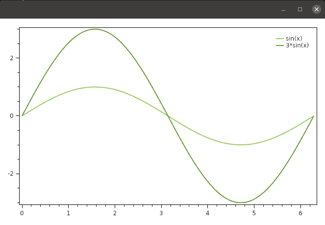
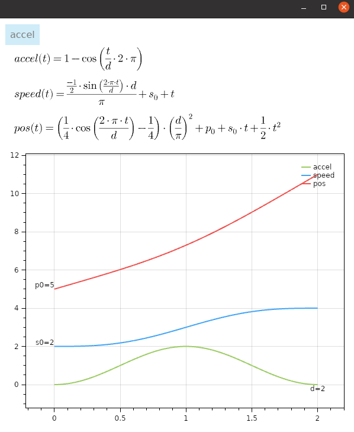

# netcore-sci

[](https://www.nuget.org/packages/netcore-sci/)

[](https://sonarcloud.io/dashboard?id=devel0_netcore-sci)

.NET core sci

- [API Documentation](https://devel0.github.io/netcore-sci/api/SearchAThing.html)
- [Changelog](https://github.com/devel0/netcore-sci/commits/master)

<hr/>

<!-- TOC -->
- [netcore-sci](#netcore-sci)
  * [Examples](#examples)
      - [0001](#0001)
      - [0002](#0002)
      - [0003](#0003)
  * [Quickstart](#quickstart)
      - [create an example](#create-an-example)
  * [Unit tests](#unit-tests)
  * [How this project was built](#how-this-project-was-built)
<!-- TOCEND -->

<hr/>

## Examples

#### 0001

create a dxf

[result dxf](examples/example_0001/output.dxf)


#### 0002

plot functions



```csharp
using static System.Math;
using SearchAThing;
using System.Linq;
using SearchAThing.Gui;
using Avalonia.Controls;
using Avalonia;
using OxyPlot;
using OxyPlot.Avalonia;
using static AngouriMath.Extensions.AngouriMathExtensions;

namespace test
{
    class Program
    {

        public class PlotData
        {
            public PlotData(double x, double y) { this.x = x; this.y = y; }
            public double x { get; set; }
            public double y { get; set; }
        }

        public class Model
        {
        }

        public class MainWindow : Win
        {
            Model m;
            PlotView pv;

            public MainWindow() : base(new[]
            {
                "resm:OxyPlot.Avalonia.Themes.Default.xaml?assembly=OxyPlot.Avalonia"
            })
            {
                m = new Model();

                var grRoot = new Grid() { DataContext = m, Margin = new Thickness(10) }; this.Content = grRoot;

                pv = new PlotView();
                pv.Model = new PlotModel();
                grRoot.Children.Add(pv);

                var f1 = new OxyPlot.Series.LineSeries()
                {
                    Title = "sin(x)",
                    DataFieldX = "x",
                    DataFieldY = "y",
                    ItemsSource = SciToolkit.Range(
                        tol: 1e-3,
                        start: 0,
                        end: 2 * PI,
                        inc: 2 * PI / 100,
                        includeEnd: true).Select(x => new PlotData(x, Sin(x))),
                    Color = OxyColor.Parse("#9ccc65")
                };
                pv.Model.Series.Add(f1);

                var f2f = "3*sin(x)"; // symbolic eval
                var f2fc = f2f.Compile("x");
                var f2 = new OxyPlot.Series.LineSeries()
                {
                    Title = "3*sin(x)",
                    DataFieldX = "x",
                    DataFieldY = "y",
                    ItemsSource = SciToolkit.Range(
                        tol: 1e-3,
                        start: 0,
                        end: 2 * PI,
                        inc: 2 * PI / 100,
                        includeEnd: true).Select(x => new PlotData(x, f2fc.Call(x).Real)),
                    Color = OxyColor.Parse("#6b9b37")
                };
                pv.Model.Series.Add(f2);

                pv.ResetAllAxes();
                pv.InvalidatePlot();

            }

            protected override void OnMeasureInvalidated()
            {
                base.OnMeasureInvalidated();

                pv.InvalidatePlot();
            }
        }

        static void Main(string[] args)
        {
            GuiToolkit.CreateGui<MainWindow>();
        }
    }
}
```

#### 0003

more elaborated plot [example 0003](examples/0003/Program.cs)



## Quickstart

- [nuget package](https://www.nuget.org/packages/netcore-sci/)

- [extension methods](https://devel0.github.io/netcore-sci/api/SearchAThing.SciExt.html)

```csharp
using SearchAThing;
```

- [toolkit methods](https://devel0.github.io/netcore-sci/api/SearchAThing.SciToolkit.html)

```csharp
using static SearchAThing.SciToolkit;
```

#### create an example

From [examples](examples) follow [example_0001](examples/0001) can be created following these steps:

- create console project

```sh
dotnet new console -n example_0001
cd example_0001
```

- add reference to netcore-sci ( check latest version [here](https://www.nuget.org/packages/netcore-sci/) )

```sh
dotnet add package netcore-sci
```

**optional** if prefer to link source code directly to stepin with debugger add project reference instead

```sh
dotnet add reference ../../netcore-sci/netcore-sci.csproj
```

- setup example code

```csharp
using static System.Math;
using SearchAThing;

namespace test
{
    class Program
    {
        static void Main(string[] args)
        {
            var tol = 1e-8;
            var R = 100;

            var dxf = new netDxf.DxfDocument();
            var ang = 0d;
            var angStep = 10d.ToRad();
            var angElev = 20d.ToRad();

            var o = Vector3D.Zero;
            var p = new Vector3D(R, 0, 0);

            Circle3D circ = null;

            while (ang < 2 * PI)
            {
                var l = new Line3D(o, p.RotateAboutZAxis(ang));
                var l_ent = l.DxfEntity;
                l_ent.Color = netDxf.AciColor.Cyan;
                dxf.AddEntity(l_ent);

                var arcCS = new CoordinateSystem3D(o, l.V, Vector3D.ZAxis);
                var arc = new Arc3D(tol, arcCS, R, 0, angElev);
                var arc_ent = arc.DxfEntity;
                arc_ent.Color = netDxf.AciColor.Yellow;
                dxf.AddEntity(arc_ent);

                var arc2CS = new CoordinateSystem3D(l.To - R * Vector3D.ZAxis,
                    Vector3D.ZAxis, Vector3D.Zero - l.To);
                var arc2 = new Arc3D(tol, arc2CS, R, 0, PI / 2);
                var arc2_ent = arc2.DxfEntity;
                arc2_ent.Color = netDxf.AciColor.Green;
                dxf.AddEntity(arc2_ent);

                if (circ == null)
                {
                    circ = new Circle3D(tol,
                        CoordinateSystem3D.WCS.Move(Vector3D.ZAxis * arc.To.Z),
                        arc.To.Distance2D(Vector3D.Zero));
                    var circ_ent = circ.DxfEntity;
                    circ_ent.Color = netDxf.AciColor.Yellow;
                    dxf.AddEntity(circ_ent);
                }

                ang += angStep;
            }

            dxf.Viewport.ShowGrid = false;
            dxf.Save("output.dxf", isBinary: true);
        }
    }
}
```

- execute

```sh
dotnet run
```

## Unit tests

- debugging unit tests
  - from vscode just run debug test from code lens balloon
- executing all tests
  - from solution root folder `dotnet test`
- testing coverage
  - from vscode run task ( ctrl+shift+p ) `Tasks: Run Task` then `test with coverage` or use provided script `./generate-coverage.sh`
  - extensions required to watch coverage ( `Coverage Gutters` )


## How this project was built

```sh
mkdir netcore-sci
cd netcore-sci

dotnet new sln
dotnet new classlib -n netcore-sci

cd netcore-sci
dotnet add package netcore-util
dotnet add package netcore-psql-util
dotnet add package netDXF.Standard
dotnet add package ParagonClipper
# follow requires nuget.config with "searchathing-forks" source key enabled
dotnet add package QuantumConcepts.Formats.STL.netcore
cd ..

dotnet new xunit -n test
cd test
dotnet tool install --global dotnet-sonarscanner
dotnet add reference ../netcore-sci/netcore-sci.csproj
dotnet add package Microsoft.NET.Test.Sdk --version 16.7.0-preview-20200519-01
dotnet add package coverlet.collector --version 1.3.0
dotnet add package coverlet.msbuild --version 2.9.0
cd ..

dotnet sln netcore-sci.sln add netcore-sci/netcore-sci.csproj
dotnet sln netcore-sci.sln add test/test.csproj
dotnet restore
dotnet build
dotnet test test/test.csproj
```
