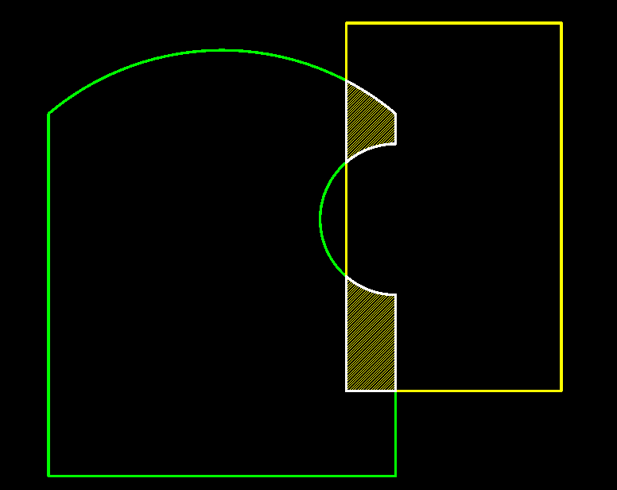

# netcore-sci

[](https://www.nuget.org/packages/netcore-sci/)

.NET core sci

- [API Documentation](https://devel0.github.io/netcore-sci/html/namespace_search_a_thing.html)
- [Changelog](https://github.com/devel0/netcore-sci/commits/master)

**note** : from v2.0.0 some tk parts were removed ( look at [v1.30](https://github.com/devel0/netcore-sci/tree/980868dd4c6b64bcccd108df90d99bb77a0cf076) for these )

<hr/>

<!-- TOC -->
* [Build](#build)
* [Examples](#examples)
    - [0001](#0001)
    - [0002](#0002)
    - [0003](#0003)
* [Quickstart](#quickstart)
    - [create an example](#create-an-example)
* [Unit tests](#unit-tests)
* [How this project was built](#how-this-project-was-built)
* [IOT](#iot)
<!-- TOCEND -->

<hr/>

## Build

*Note*: To make netcore-util debuggable as code comment `PackageReference` and uncomment `ProjectReference` for corresponding netcore-util reference.

```sh
mkdir ~/opensource
git clone https://github.com/devel0/netcore-util.git
git clone https://github.com/devel0/netcore-sci.git

cd netcore-sci
#git submodule update --init --recursive
dotnet build
```

## Examples

#### 0001

create a dxf

[result dxf](https://raw.githubusercontent.com/devel0/netcore-sci/master/examples/0001/output.dxf)


#### 0002

detect polygons ( line, arcs ) intersection loops

[result dxf](https://raw.githubusercontent.com/devel0/netcore-sci/master/examples/0002/output.dxf)



#### 0003

detect polygons ( line, arcs ) intersection loops when edges overlaps

[result dxf](https://raw.githubusercontent.com/devel0/netcore-sci/master/examples/0003/output.dxf)


## Quickstart

- [nuget package](https://www.nuget.org/packages/netcore-sci/)

- [extension methods](https://devel0.github.io/netcore-sci/html/class_search_a_thing_1_1_sci_ext.html)

```csharp
using SearchAThing;
```

- [toolkit methods](https://devel0.github.io/netcore-sci/html/class_search_a_thing_1_1_sci_toolkit.html)

```csharp
using static SearchAThing.SciToolkit;
```

#### create an example

From [examples](examples) follow [example_0001](examples/0001) can be created following these steps:

- create console project

```sh
dotnet new console -n example_0001
cd example_0001
```

- add reference to netcore-sci ( check latest version [here](https://www.nuget.org/packages/netcore-sci/) )

```sh
dotnet add package netcore-sci
```

**optional** if prefer to link source code directly to stepin with debugger add project reference instead

```sh
dotnet add reference ../../netcore-sci/netcore-sci.csproj
```

- setup example code

```csharp
using static System.Math;
using SearchAThing;

namespace test
{
    class Program
    {
        static void Main(string[] args)
        {
            var tol = 1e-8;
            var R = 100;

            var dxf = new netDxf.DxfDocument();
            var ang = 0d;
            var angStep = 10d.ToRad();
            var angElev = 20d.ToRad();

            var o = Vector3D.Zero;
            var p = new Vector3D(R, 0, 0);

            Circle3D circ = null;

            while (ang < 2 * PI)
            {
                var l = new Line3D(o, p.RotateAboutZAxis(ang));
                var l_ent = l.DxfEntity;
                l_ent.Color = netDxf.AciColor.Cyan;
                dxf.AddEntity(l_ent);

                var arcCS = new CoordinateSystem3D(o, l.V, Vector3D.ZAxis);
                var arc = new Arc3D(tol, arcCS, R, 0, angElev);
                var arc_ent = arc.DxfEntity;
                arc_ent.Color = netDxf.AciColor.Yellow;
                dxf.AddEntity(arc_ent);

                var arc2CS = new CoordinateSystem3D(l.To - R * Vector3D.ZAxis,
                    Vector3D.ZAxis, Vector3D.Zero - l.To);
                var arc2 = new Arc3D(tol, arc2CS, R, 0, PI / 2);
                var arc2_ent = arc2.DxfEntity;
                arc2_ent.Color = netDxf.AciColor.Green;
                dxf.AddEntity(arc2_ent);

                if (circ == null)
                {
                    circ = new Circle3D(tol,
                        CoordinateSystem3D.WCS.Move(Vector3D.ZAxis * arc.To.Z),
                        arc.To.Distance2D(Vector3D.Zero));
                    var circ_ent = circ.DxfEntity;
                    circ_ent.Color = netDxf.AciColor.Yellow;
                    dxf.AddEntity(circ_ent);
                }

                ang += angStep;
            }

            dxf.Viewport.ShowGrid = false;
            dxf.Save("output.dxf", isBinary: true);
        }
    }
}
```

- execute

```sh
dotnet run
```

## Unit tests

- debugging unit tests
  - from vscode just run debug test from code lens balloon
- executing all tests
  - from solution root folder `dotnet test`
- testing coverage
  - from vscode run task ( ctrl+shift+p ) `Tasks: Run Task` then `test with coverage` or use provided script `./generate-coverage.sh`
  - extensions required to watch coverage ( `Coverage Gutters` )


## How this project was built

```sh
mkdir netcore-sci
cd netcore-sci

dotnet new sln
dotnet new classlib -n netcore-sci

cd netcore-sci
dotnet add package netcore-util
dotnet add package netcore-psql-util
dotnet add package netDXF.Standard
dotnet add package ParagonClipper
# follow requires nuget.config with "searchathing-forks" source key enabled
dotnet add package QuantumConcepts.Formats.STL.netcore
cd ..

dotnet new xunit -n test
cd test
dotnet tool install --global dotnet-sonarscanner
dotnet add reference ../netcore-sci/netcore-sci.csproj
dotnet add package Microsoft.NET.Test.Sdk --version 16.7.0-preview-20200519-01
dotnet add package coverlet.collector --version 1.3.0
dotnet add package coverlet.msbuild --version 2.9.0
cd ..

dotnet sln netcore-sci.sln add netcore-sci/netcore-sci.csproj
dotnet sln netcore-sci.sln add test/test.csproj
dotnet restore
dotnet build
dotnet test test/test.csproj
```

## IOT

[iot-sci](https://github.com/devel0/iot-sci) is a c++ port of this library.
